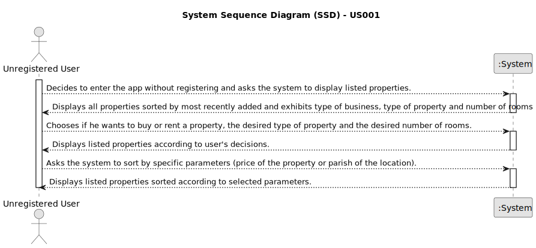

# US 001 -  As an unregistered user, I want to display listed properties.

## 1. Requirements Engineering

### 1.1. User Story Description

As an unregistered user, I want to display listed properties.

### 1.2. Customer Specifications and Clarifications 

**From the specifications document:**

>	Unregistered users can only list properties.

>	The client must select the type of property and the number of rooms in that residence.

>   The user can sort displayed properties by different criteria, such as price of the estate or parish of the location.

**From the client clarifications:**

> 2023/03/20
>
> **Question 1:** In the project's documentation it's mentioned that "All those who wish to use the application must be authenticated", but in the US1 it's said that an unregistered user can see a list of properties. Can users who aren't authenticated do this?
>  
> **Answer 1:** Non-authenticated users can only list properties.
>
> 
> **Question 2:** The properties can be in sale and lease at the same time?
>
> **Answer 2:** No.
> 
> 
> **Question 3:** Can an unregistered user only see sale announcements or he is able to contact the agency agents to make a purchase request?
>
> **Answer 3:** From the project description: "As an unregistered user, I want to display listed properties". For now this is the only functionality of the system that the non-registered user can use.

> 2023/03/21
>
> **Question 4:** In the project description it is stated that "the client is, then, responsible for being able to consult the properties by type, number of rooms, and sort by criteria such as price or the parish where the property is located.". Is the client able to sort properties by only these 4 criteria or is he able to sort properties by any of the properties' characteristics?
>
> **Answer 4:** The client should be able to select the type of business (renting or buying), the type of property and the number of rooms. Then, the client should be able to sort properties by price or by parish where the property is located. If the client does not select the type of business, the type of property and the number of rooms, the application should allow the client to sort all properties that are on sale or on renting.
>
>
> **Question 5:** When an unregistered user opens the application, are there already properties being listed?
>
> **Answer 5:** If the system does not contain any properties, the system should show an empty list of properties.

> 2023/03/28
> 
> **Question 6:** When an unregistered user wants to list properties, the list given by the program is sorted by default with which criteria? For example the list is shown with the properties sorted by most recently added?
> 
> **Answer 6:** By default, the list should be shown with the properties sorted by most recently added.
>
> 
> **Question 7:** Can a user filter the properties list for example by a type but choosing multiple values? For example the users wants to see only properties with 3 or 4 rooms. If this is possible, after filtering the list to show only the values chosen, he can sort by ascending/descending?
> 
> **Answer 7:** The user should select only one value for each feature of the property.

### 1.3. Acceptance Criteria

* **AC1:** The unregistered user, when listing properties, can see everything but agency's commissions.
* **AC2:** The user isn't able to contact the agency through the app unless he registers.
* **AC3:** Every filter can only have one value.
* **AC4:** The user sees no or lot properties.

### 1.4. Found out Dependencies

* There could exist a dependency to "US002" since to display listed properties successfully it should be necessary to exist properties inserted in the system. However, since according to client clarifications, if there are no properties listed the program should show an empty list, there are no dependencies to other User Stories.

### 1.5 Input and Output Data

**Input Data:**

* Selected data:
  * Buy/Rent option
  * Type of property
  * Number of rooms
  * Sorting filters, such as price of the property or parish of its location

**Output Data:**

* List of all properties
* List of a certain type of property for sale/rent, with a defined number of rooms, according to user's choices
* List of those properties sorted according to user's selected filters

### 1.6. System Sequence Diagram (SSD)

**Other alternatives might exist.**

