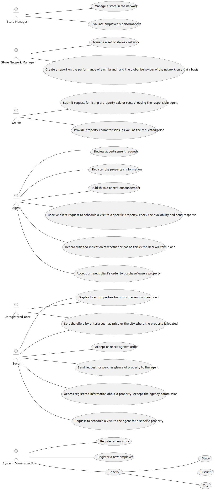

# Use Case Diagram (UCD)

**In the scope of this project, there is a direct relationship of _1 to 1_ between Use Cases (UC) and User Stories (US).**

# Use Cases / User Stories

| UC/US  | Description                                                                                                                             |                   
|:-------|:----------------------------------------------------------------------------------------------------------------------------------------|
| US 001 | [As an unregistered user, I want to display listed properties.](../../US001/Readme.md)                                                  |
| US 002 | [As an agent, I can publish any sale announcement on the system, for example received through a phone call.](../../US002/Readme.md)     |
| US 003 | [As a system administrator, I want to register a new employee.](../../US003/Readme.md)                                                  |
| US 004 | [As an owner, I intend to submit a request for listing a property sale or rent, choosing the responsible agent.](../../US004/Readme.md) |
| US 005 | [As a system administrator, I want to register a store.](../../US005/Readme.md)                                                         |
| US 006 | [As a system administrator, I want to specify states, districts and cities in the system.](../../US006/Readme.md)                       |
