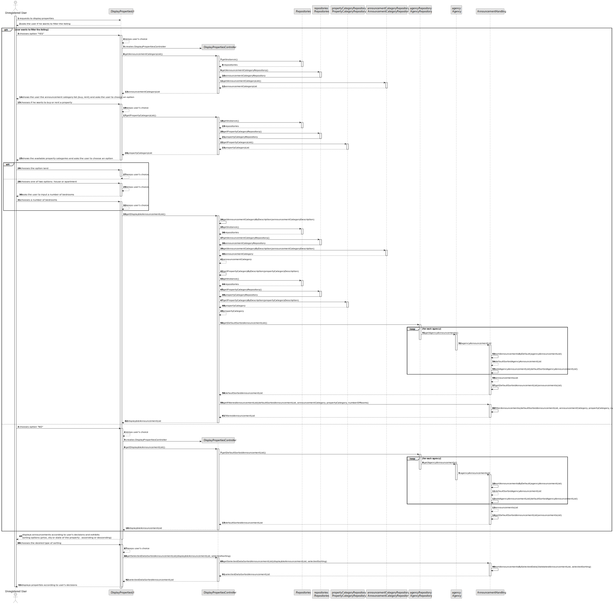
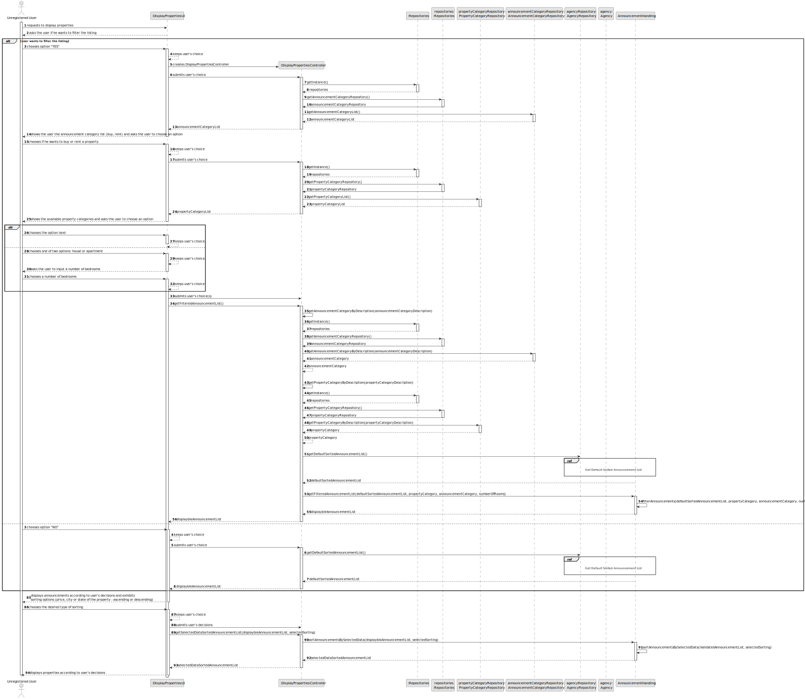
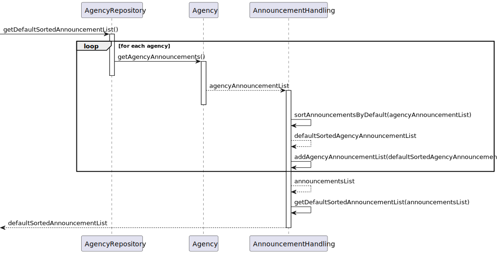
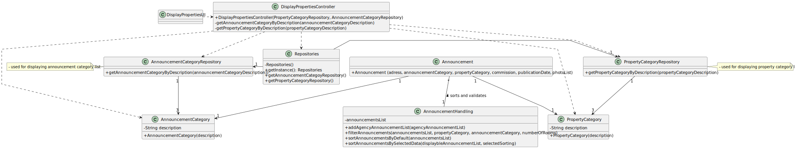

# US 001 - As an unregistered user, I want to display listed properties

## 3. Design - User Story Realization 

### 3.1. Rationale

| Interaction ID                                                                                              | Question: Which class is responsible for...                       | Answer                         | Justification (with patterns)                                                                                               |
|:------------------------------------------------------------------------------------------------------------|:------------------------------------------------------------------|:-------------------------------|:----------------------------------------------------------------------------------------------------------------------------|
| Step 1 : Decides to enter the app without registering and requests to see the displayed properties.         | ... interacting with the user?                                    | DisplayPropertiesUI            | Pure Fabrication: there is no reason to assign this responsibility to any existing class in the Domain Model.               |
| 	                                                                                                           | ... coordinating the US?                                          | DisplayPropertiesController    | Controller: this class is responsible for coordinating and distributing the actions perfomed on the UI to the domain layer. |
| Step 2 : Asks the user if he wants to filter the listing (_Yes_/_No_)                                       | ... displaying "Yes" or "No" options                              | DisplayPropertiesUI            | Pure Fabrication: there is no reason to assign this responsibility to any existing class in the Domain Model.               |
| Step 3 : Selects if filters will be chosen.                                                                 | ... temporarily saving the inputted data?		                       | DisplayPropertiesUI            | Pure Fabrication: there is no reason to assign this responsibility to any existing class in the Domain Model.               |
|                                                                                                             | ... determining the course of the application upon user's choice? | DisplayPropertiesController    | Controller: this class is responsible for coordinating and distributing the actions perfomed on the UI to the domain layer. |  
| Step 4 : If option _Yes_ is chosen, shows type of business and type of property options                     | ... knowing the existing type of business options?                | AnnouncementCategoryRepository | Information Expert : class created to handle that responsibility.                                                           |
| (if the type of property is _house_ or _apartment_, the user chooses a number of rooms - integer variable). | ... knowing the existing type of property options?                | PropertyCategoryRepository     | Information Expert : class created to handle that responsibility.                                                           |
|                                                                                                             | ... temporarily saving the inputted data?                         | DisplayPropertiesUI            | Pure Fabrication: there is no reason to assign this responsibility to any existing class in the Domain Model.               |
| Step 5 : Displays properties sorted by default (most recently added) and exhibits sorting options.          | ... sorting properties by most recently added?                    | AnnouncementValidation         | Pure Fabrication: there is no reason to assign this responsibility to any existing class in the Domain Model.               |
|                                                                                                             | ... exhibiting sorting options?                                   | DisplayPropertiesUI            | Pure Fabrication: there is no reason to assign this responsibility to any existing class in the Domain Model.               |
|                                                                                                             | ... displaying properties?                                        | DisplayPropertiesUI            | Pure Fabrication: there is no reason to assign this responsibility to any existing class in the Domain Model.               |
| Step 6: Chooses the desired type of sorting.                                                                | ... temporarily saving the inputted data?	                        | DisplayPropertiesUI            | Pure Fabrication: there is no reason to assign this responsibility to any existing class in the Domain Model.               |
| Step 7: Display listed properties according to user's decisions.                                            | ... sorting properties by selected data?	                         | AnnouncementValidation         | Pure Fabrication: there is no reason to assign this responsibility to any existing class in the Domain Model.               |
|                                                                                                             | ... displaying properties?                                        | DisplayPropertiesUI            | Pure Fabrication: there is no reason to assign this responsibility to any existing class in the Domain Model.               |
### Systematization ##

According to the taken rationale, the conceptual class(es) promoted to software class(es) is(are): 

 * Agency

Other software classes identified: 

 * DisplayPropertiesUI  
 * DisplayPropertiesController
 * AgencyRepository
 * AnnouncementCategoryRepository
 * PropertyCategoryRepository
 * AnnouncementHandling

## 3.2. Sequence Diagram (SD)

### Alternative 1 - Full Diagram

This diagram shows the full sequence of interactions between the classes involved in the realization of this user story.

### Alternative 2 - Split Diagram

This diagram shows the same sequence of interactions between the classes involved in the realization of this user story, but it is split in partial diagrams to better illustrate the interactions between the classes.

It uses interaction ocurrence.

**Get Default Sorted Announcement List**

## 3.3. Class Diagram (CD)

