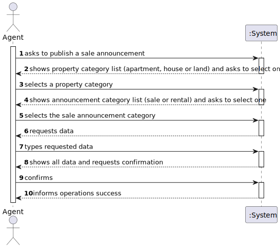

# US 002 - As an agent, I can publish any sale announcement on the system, for example received through a phone call.

## 1. Requirements Engineering

### 1.1. User Story Description

As an agent, I can publish any sale announcement on the system, for example received through a phone call.

### 1.2. Customer Specifications and Clarifications

**From the specifications document:**

> The commission can be a fixed amount or a percentage.
 
> The agent registers different information based on the property type.

> All registered information, except the agency commission, can be accessed by the client who intends to buy the property.

> ...

**From the client clarifications:**

> **Question:** When the request arrives at the agent, are all the essential characteristics of the property in question already present?

> **Answer:** Yes.

> **Question:** What is the value for the fixed amount comission? Is it the same for all agents?

> **Answer:** The commission is for the agency and for that given property.

> **Question:** Is it mandatory for the agent to input the commission value before publishing an announcement?

> **Answer:** Yes.

> **Question:** When the agent receives the phone call (as mentioned in US002) is it the agent who registers the order in the system or has the order already been entered into the system by the owner?

> **Answer:** The agent registers the order in the system.

> **Question:** In US002, does the agent only register the request in the system that he receives from the owner in a phone call, or can he (the agent) also accept/reject requests that the owner registers in the system (without a phone call)?
 
> **Answer:** The agent only publishes the sale announcement that he receives from the owner in a phone call.  The agent that receives the phone call is the property responsible agent.

> **Question:**  Is the owner able to edit an already active listing of a property? If so, do the edits need to be accepted by the agent before being published?

> **Answer:** No.

> **Question:** 
 
> **Answer:**  
 
### 1.3. Acceptance Criteria

* **AC1:** Can only choose one announcement category.
* **AC2:** All required fields must be filled in.
* **AC3:** Only one type of property can be selected, either house, apartmend or land.
* **AC4:** The property characteristics differ in between types of property.
* **AC5:** At least one photo is required.
* **AC6:** Commission should be a positive number different from 0, either a fixed value or percentage.
* **AC5:** ...

### 1.4. Found out Dependencies

* There is a dependency to "US004 - To  submit a request for listing a property" since it's mandatory that the owner chooses an agent, which is going to be responsible for a sale of a property.
* There is a dependency to "US003 - To register a new employee." since you need an agent.
* There is a dependency to "US001 -  As an unregistered user, I want to display listed properties." since there needs to exist announcements so they can be listed.

### 1.5 Input and Output Data

**Input Data:**

* Typed data:
    * Property characteristics
    * Commission value (fixed amount or percentage)
    * Requested price for sale
    * ...
    
* Selected data:
    * Sale announcement category
    * Property category
    * Confirmation 
    * ...

**Output Data:**

* Announcement category list (sale or rental)
* Property category list (house, apartment or land)
* Confirmation request
* (In)Success of the operation
* ...

### 1.6. System Sequence Diagram (SSD)

**Other alternatives might exist.**

#### Alternative One

### 1.7 Other Relevant Remarks

* After sold/rented, the announcement doesn't leave the system.