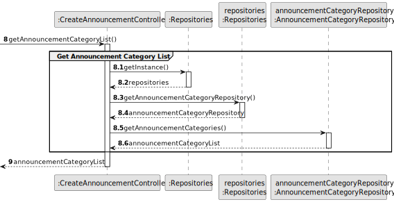
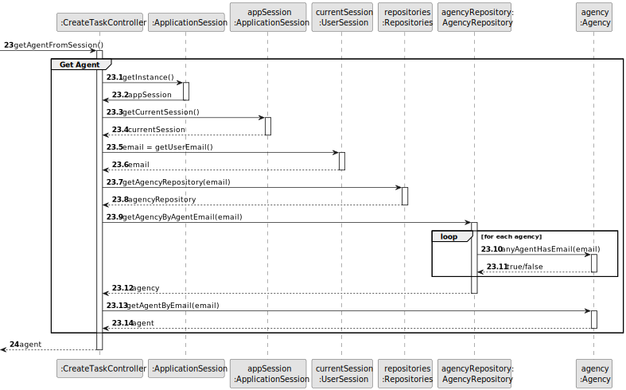
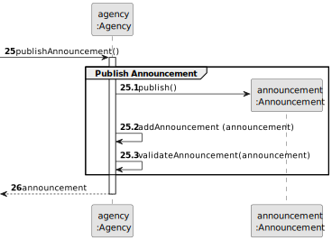

# US 002 - As an agent, I can publish any sale announcement on the system, for example received through a phone call.

## 3. Design - User Story Realization

### 3.1. Rationale

**SSD - Alternative 1 is adopted.**

| Interaction ID                                                | Question: Which class is responsible for...       | Answer                        | Justification (with patterns)                                                                                 |
|:--------------------------------------------------------------|:--------------------------------------------------|:------------------------------|:--------------------------------------------------------------------------------------------------------------|
| Step 1 : asks to publish a sale announcement  		              | 	... interacting with the actor?                  | PublishAnnouncementUI         | Pure Fabrication: there is no reason to assign this responsibility to any existing class in the Domain Model. |
| 			  		                                                       | 	... coordinating the US?                         | PublishAnnouncementController | Controller                                                                                                    |
| 			  		                                                       | 	... instantiating a new Announcement?            | Agency                        | Creator (Rule 1): in the DM Agency has an Announcement.                                                       |
| 			  		                                                       | ... knowing the Agent using the system?           | AgentSession                  | IE: cf. A&A component documentation.                                                                          |
| 			  		                                                       | 							                                           | Agency                        | IE: knows/has its own Agents                                                                                  |
| 			  		                                                       | 							                                           | Agent                         | IE: knows its own data                                                                                        |
| Step 2 : shows property category list and asks to select one		 | 	...knowing the property categories to show?					 | System                        | IE: Property Categories are defined by the System Administrator.                                              |
| Step 3 :	selects a property category	                         | 	...saving the selected category?                 | Announcement                  | IE: Object created in step 1 is classified in one property category.                                          |
| Step 4 : shows announcement category		                        | 	...knowing the announcement categories to show?  | System                        | IE: Announcement Categories are defined by the System Administrator.                                          |
| Step 5 : selects the sale announcement category		             | 	... saving the selected category?                | Announcement                  | IE: object created in step 1 is classified in one announcement category.                                      |
| Step 6 : requests data		                                      | 							                                           |                               |                                                                                                               |              
| Step 7 : types requested data                                 | 	... validating all data (local validation)?      | Announcement                  | IE: owns its data.                                                                                            | 
| 			  		                                                       | 	... validating all data (global validation)?     | Agency                        | IE: knows all its tasks.                                                                                      | 
| 			  		                                                       | 	... saving the created announcement?             | Agency                        | IE: owns all its tasks.                                                                                       | 
| Step 8 : shows all data and requests confirmation	            | 	                                                 |                               |                                                                                                               | 
| Step 9 : confirms                                             | ... validating all data (local validation)?       | Announcement                  | IE: owns its data.                                                                                            |
|                                                               | ... validating all data (global validation)?      | Agency                        | IE: knows all its announcements.                                                                              |
|                                                               | ... saving the published announcement?            | Agency                        | IE: owns all its announcements.                                                                               |
| Step 10 : informs operation sucess                            | ...informing operation success?                   | PublishAnnouncementUI         | IE: is responsible for user interactions.                                                                     |

### Systematization ##

According to the taken rationale, the conceptual classes promoted to software classes are:

* Agency
* Announcement

Other software classes (i.e. Pure Fabrication) identified:

* PublishAnnouncementUI
* PublishAnnouncementController

## 3.2. Sequence Diagram (SD)

### Alternative 1 - Full Diagram

This diagram shows the full sequence of interactions between the classes involved in the realization of this user story.

### Alternative 2 - Split Diagram

This diagram shows the same sequence of interactions between the classes involved in the realization of this user story,
but it is split in partial diagrams to better illustrate the interactions between the classes.

It uses interaction ocurrence.

**Get Property Category List Partial SD**

**Get Announcement Category List Partial SD**

**Get Property Category Object Partial SD**

**Get Announcement Category Object Partial SD**

**Get Agent Partial SD**

**Publish Announcement Partial SD**

## 3.3. Class Diagram (CD)

