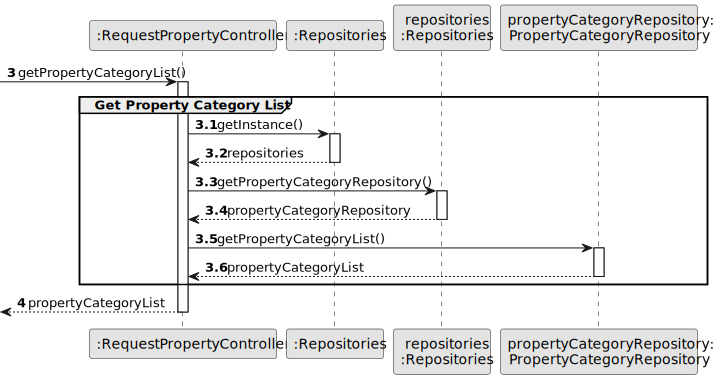

# US 004 - As an owner, I intend to submit a request for listing a property sale or rent, choosing the responsible agent.

## 3. Design - User Story Realization 

### 3.1. Rationale

| Interaction ID                                                                                   | Question: Which class is responsible for...        | Answer                    | Justification (with patterns)                                                                                 |
|:-------------------------------------------------------------------------------------------------|:---------------------------------------------------|:--------------------------|:--------------------------------------------------------------------------------------------------------------|
| Step 1 : asks to submit a request for listing a property  		                                     | 	... interacting with the actor?                   | RequestPropertyUI         | Pure Fabrication: there is no reason to assign this responsibility to any existing class in the Domain Model. |
| 			  		                                                                                          | 	... coordinating the US?                          | RequestPropertyController | Controller                                                                                                    |
| 			  		                                                                                          | 	... instantiating a new Request?                  | Owner                     | Creator (Rule 1): in the DM Organization has a Request.                                                       |
| 			  		                                                                                          | ... knowing the user using the system?             | UserSession               | IE: cf. A&A component documentation.                                                                          |
| 			  		                                                                                          | 							                                            | Agency                    | IE: knows/has its own Agents                                                                                  |
| 			  		                                                                                          | 							                                            | Agent                     | IE: knows its own data                                                                                        |
| Step 2 : shows property category list (apartment, house or land) and asks to select one		        | 		...knowing the property categories to show?					 | System                    | IE: Property Categories are defined by the System Administrator.                                              |
| Step 3 : selects a property category  		                                                         | 	...saving the selected category?                  | Sale request/Rent request | IE: Object created in step 1 is classified in one property category.                                          |
| Step 4 : shows announcement  category list (sale or rental) and asks to select one               | 	...knowing the announcement categories to show?   | System                    | IE: Announcement Categories are defined by the System Administrator.                                          |
| Step 5 : selects sale  		                                                                        | 	... saving the selected category?                 | Sale request              | IE: object created in step 1 is classified in one announcement Category.                                      |
| Step 6 : requests price 		                                                                       | 							                                            |                           |                                                                                                               |              
| Step 7 : introduces price  		                                                                    | 	... validating all data (local validation)?       | Sale request              | IE: owns its data.                                                                                            |  
| Step 8 : selects rental  		                                                                      | 	... saving the selected category?                 | Rent request              | IE: object created in step 1 is classified in one announcement Category.                                      |
| Step 9 : requests rent 		                                                                        | 							                                            |                           |                                                                                                               |              
| Step 10 : introduces monthly rent  		                                                            | 	... validating all data (local validation)?       | Rent request              | IE: owns its data.                                                                                            |
| Step 11 : requests photographs 		                                                                | 	                                                  |                           |                                                                                                               | 
| Step 12 : introduces the URI of photographs  		                                                  | 	... validating all data (local validation)?       | Sale request/Rent request            | IE: owns its data.                                                                                            |
| 			  		                                                                                          | 	... validating all data (global validation)?      | Agency                    | IE: knows all its tasks.                                                                                      | 
| Step 13 : requests information 		                                                                | 	                                                  |                           |                                                                                                               | 
| Step 14 : introduces requested information (property charactheristics, location)  		             | 	... validating all data (local validation)?       | Sale request/Rent request              | IE: owns its data.                                                                                            |
| 			  		                                                                                          | 	... validating all data (global validation)?      | Agency                    | IE: knows all its tasks.                                                                                      | 
| 			  		                                                                                          | 	... saving the created request?                   | Agency                    | IE: owns all its tasks.                                                                                       |
| Step 15 : shows list of all agencies and asks to select one                                      | 	...knowing the agencies to show?                  | System                    | IE: Agencies are defined by the System Administrator.                                                         |
| Step 16 : chooses an agency from the list  		                                                    | 	... saving the selected agency?                   | Sale request/Rent request              | IE: object created in step 1 is classified in one Agency.                                                     |
| Step 17 : shows list of agents available that work on the selected agency and asks to select one | 	...knowing the agents to show?                    | System                    | IE: Agents are defined by the System Administrator.                                                           |
| Step 18 : chooses an agent from the list  		                                                     | 	... saving the selected agent?                    | Sale request/Rent request              | IE: object created in step 1 is classified in one Agent.                                                      |
| Step 19 : shows all data and requests confirmation	                                              | 	                                                  |                           |                                                                                                               | 
| Step 20 : confirms                                                                               | ... validating all data (local validation)?        | Sale request/Rent request             | IE: owns its data.                                                                                            |
|                                                                                                  | ... validating all data (global validation)?       | Agency                    | IE: knows all its requests.                                                                                   |
|                                                                                                  | ... saving the request?                            | Agency                    | IE: owns all its requests.                                                                                    |
| Step 21 : informs operation sucess                                                               | ...informing operation success?                    | RequestAnnouncementUI     | IE: is responsible for user interactions.                                                                     |

### Systematization ##

According to the taken rationale, the conceptual classes promoted to software classes are: 

 * Sale Request
 * Rent Request
 * Agency 

Other software classes (i.e. Pure Fabrication) identified: 

 * RequestPropertyUI  
 * RequestPropertyController

## 3.2. Sequence Diagram (SD)

### Alternative 1 - Full Diagram

This diagram shows the full sequence of interactions between the classes involved in the realization of this user story.

### Alternative 2 - Split Diagram

This diagram shows the same sequence of interactions between the classes involved in the realization of this user story, but it is split in partial diagrams to better illustrate the interactions between the classes.

It uses interaction ocurrence.

**Get Property Category List Partial SD**

**Get Announcement Category List Partial SD**

**Get Agency List Partial SD**

**Get Agent List Partial SD**

**Get Property Category Object Partial SD**

**Get Announcement Category Object Partial SD**

**Inttroduces photographs Partial SD**

**Get Agency Object Partial SD**

**Get Agent Object Partial SD**

**Submit Request Partial SD**

## 3.3. Class Diagram (CD)

