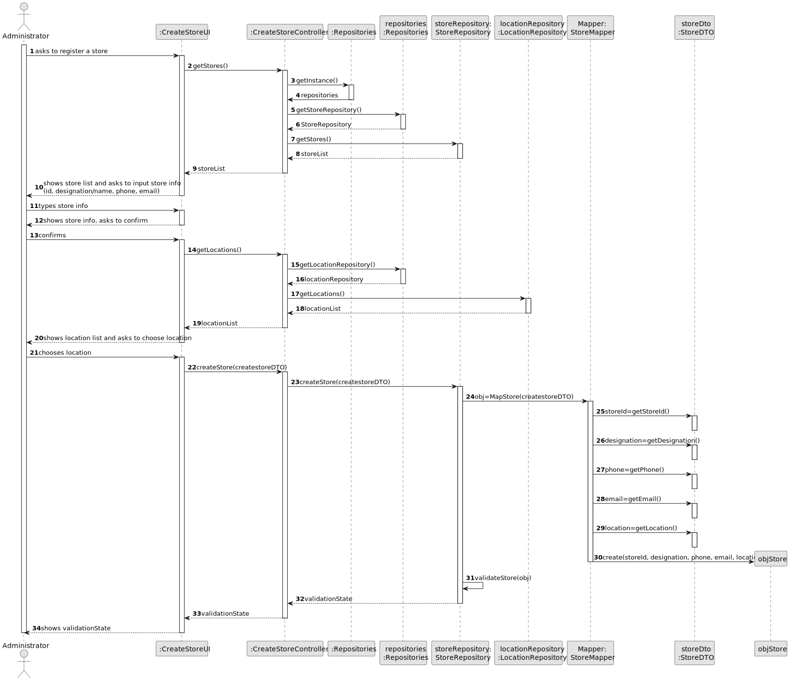
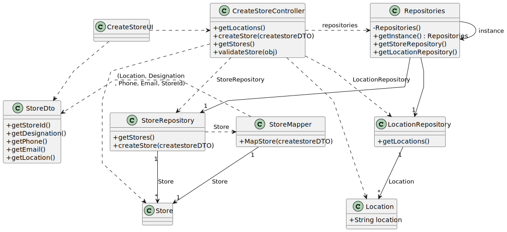

# US 006 - To create a Task 

## 3. Design - User Story Realization 

### 3.1. Rationale

**SSD - Alternative 1 is adopted.**

| Interaction ID | Question: Which class is responsible for... | Answer                 | Justification (with patterns)                                                                                   |
|:-------------  |:--------------------- |:---------------------|:--------------------------------------------------------------------------------------------------------------|
| Step 1  		 | ... interacting with the actor? | :CreateStoreUI       | Pure Fabrication: there is no reason to assign this responsibility to any existing class in the Domain Mode. Interacts with the administrator to register a store.              |
| 			  		 | ... coordinating the US? | :CreateStoreController | Controller: Interaction between the UI and the repositories             |
| 			  		 | ... Knowing the Repositories? | :Repositories    | IE,Creator (Singleton): Returns StoreRepository and LocationRepository required for the creation of a store and return of Lists. 
| 			  		 | ... instantiating a new Store? | :AgencyRepository    | Creator 1,2: Contains and records instances                                                  |
| 			  		 | ... validating the data locally? | :Agency    | IE: The agency knows its own data                                                  |
| 			  		 | ... Mapping the inputed information  | :StoreMapper   |  Mapper.                     |
| 			  		 | ... knowing the user using the system?  | :UserSession     |                       |
| 			  		 | ... knowing the Locations?  | :LocationRepository     |   Repository: Handles the data persistence operations for Locations. Knows its own data                   |
| 			  		 | ... knowing the Stores?  | :StoreRepository     |  Repository: Handles the data persistence operations for stores. Knows its own data                 |
| |...Knowing inputed data?|:StoreDto |DTO: Send inputed data organized due to lots os parameters.|
| Step 2  		 | ... saving the inputted data? | :Store     | Object: Object Knows its own data                                               |
| Step 3  		 | ... knowing the Stores/Locations to show? | :CreateStoreController | Controller: Retrieves the list of locations/Stores to be shown.        |
| Step 4	 | ... validating all data (local validation)? | :StoreRepository     | Repository: Performs local validation on the store data, such as checking for duplicate store IDs,emails,phones...             |
| 			  		 | ... saving the created Store? | :StoreRepository     | Repository: Saves the created store object with all the inputted data.                                        |
| Step 5  		 | ... informing operation success?| :CreateStoreUI       | IE: is responsible for user interactions.         |
### Systematization ##

According to the taken rationale, the conceptual classes promoted to software classes are: 

 * StoreMapper
 * Store

Other software classes (i.e. Pure Fabrication) identified: 

 * CreateStoreUI  
 * CreateStoreController
Patterns:
 * Repository
 * UI + Controller + Repository

## 3.2. Sequence Diagram (SD)

### Alternative 1 - Full Diagram

This diagram shows the full sequence of interactions between the classes involved in the realization of this user story.

