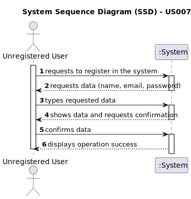

# US 007 - As an unregistered user, I want to register in the system to buy, sell or rent properties.

## 1. Requirements Engineering

### 1.1. User Story Description

As an unregistered user, I want to register in the system to buy, sell or rent properties.

### 1.2. Customer Specifications and Clarifications

**From the specifications document:**

> All those who wish to use the application must be authenticated with a password of seven alphanumeric characters, including three capital letters and two digits

**From the client clarifications:**

> Thursday, 20 of April, 09:57
>
>**Question**: You said that the owner can choose a password, but how many letters, numbers... it needs to have?
> 
>**Answer**: In the Project Description we get: "All those who wish to use the application must be authenticated with a password of seven alphanumeric characters, including three capital letters and two digits". Please read the documentation and clarifications made by the client.

>  Thursday, 20 of April, 12:21
>
> **Question**: When registering a user, should the application ask if they are registering as a client or an Owner?
>
> **Answer**: No. When registering a user, in US7, we are registering a user that can buy, sell or rent properties. After registering, when this user logins in the system, the user should have access to both owner and client functionalities.

> Thursday, 20 of April, 12:23
> 
> **Question**: In a question earlier you presented the owner attributes. Does the client have different attributes?
>
> **Answer**: A owner is also a client of the Real Estate USA company. The attributes are the same. This distinction between owner and client intends to make an association with the type of business. The Owner sells and provides properties for renting and the client buys and rents properties. Again, when the user (registered in US7) logins in the system, the user should have access to both owner and client functionalities.

> Monday, 24 of April, 12:35
> 
> **Question**: When a user starts a registration, does the application need to validate if the data is valid (for example: blank text box, email without @, etc)?
> 
> **Answer**: Data validation is always a good practice.

### 1.3. Acceptance Criteria

* **AC1:** User should have both owner and client functionalities.
* **AC2:** It needs to have a password with seven alphanumeric characters, including three capital letters and two digits.

### 1.4. Found out Dependencies

* There are no dependencies to other User Stories.

### 1.5 Input and Output Data

**Input Data:**
* Typed data:
  * name
  * email
  * password

**Output Data:**
* (In)success of the operation

### 1.6. System Sequence Diagram (SSD)

