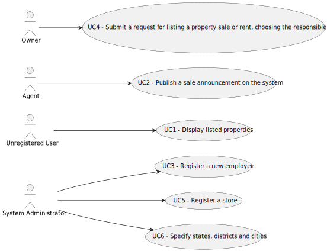

# Use Case Diagram (UCD)

**In the scope of this project, there is a direct relationship of _1 to 1_ between Use Cases (UC) and User Stories (US).**

# Use Cases / User Stories

| UC/US  | Description                                                                                                                                                                     |                   
|:-------|:--------------------------------------------------------------------------------------------------------------------------------------------------------------------------------|
| UC 001 | [Display listed properties](../../US001/Readme.md)                                                                                                                              |
| UC 002 | [Publish a sale announcement on the system](../../US002/Readme.md)                                                                                                              |
| UC 003 | [Register a new employee](../../US003/Readme.md)                                                                                                                                |
| UC 004 | [Submit a request for listing a property sale or rent, choosing the responsible agent](../../US004/Readme.md)                                                                   |
| UC 005 | [Register a store](../../US005/Readme.md)                                                                                                                                                       |
| UC 006 | [Specify states, districts and cities](../../US006/Readme.md)                                                               |
