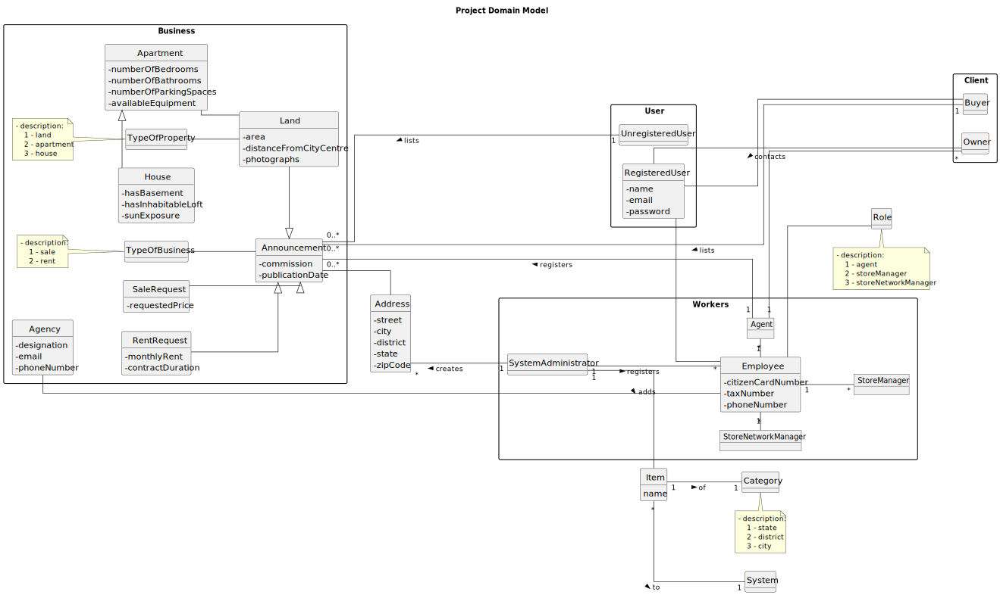

# Analysis

The construction process of the domain model is based on the client specifications, especially the nouns (for _
concepts_) and verbs (for _relations_) used.

## Rationale to identify domain conceptual classes ##

To identify domain conceptual classes, the team started by making a list of candidate conceptual classes inspired by the
list of categories suggested in the book "Applying UML and Patterns: An Introduction to Object-Oriented Analysis and
Design and Iterative Development".

### _Conceptual Class Category List_ ###

**Business Transactions**

* The transaction occurs between the Owner and the Client
* The transaction is on behalf of the business entity and it's not for an individual purpose
* Financial transaction (it involves transferring money from one account to another)

---

**Transaction Line Items**

* Every product on the order is referenced by a record that includes quantity and a reference to which order it belongs

---

**Product/Service related to a Transaction or Transaction Line Item**

* Land
* Apartment
* House

---

**Transaction Records**

* A written document or notice containing the specific terms and conditions of an Investment or Transaction entered into
  by the agency

---  

**Roles of People or Organizations**

* Unregistered User
* Buyer
* Owner
* Agent
* System Administrator
* Store Manager
* Store Network Manager

---

**Places**

* Agencies / Stores

---

**Noteworthy Events**

* Meetings with Agent
* Agent can create an announcement
* Owner can list a property for sale/rent, choosing the responsible agent.

---

**Physical Objects**

* n/a

---

**Descriptions of Things**

* n/a

---

**Catalogs**

* n/a

---

**Containers**

* n/a

---

**Elements of Containers**

* n/a

---

**Organizations**

* n/a

---

**Other External/Collaborating Systems**

* Phone call

---

**Records of finance, work, contracts, legal matters**

* n/a

---

**Financial Instruments**

* n/a

---

**Documents mentioned/used to perform some work/**

* n/a

---

## Rationale to identify associations between conceptual classes

An association is a relationship between instances of objects that indicates a relevant connection and that is worth of
remembering, or it is derivable from the List of Common Associations:

+ **_A_** is physically or logically part of **_B_**
+ **_A_** is physically or logically contained in/on **_B_**
+ **_A_** is a description for **_B_**
+ **_A_** known/logged/recorded/reported/captured in **_B_**
+ **_A_** uses or manages or owns **_B_**
+ **_A_** is related with a transaction (item) of **_B_**
+ etc.

| Concept (A) 	 | Association  | Concept (B)  |
|---------------|--------------|--------------|
| C1  	         | verb1    		 	 | C2           |
| ...  	        | ...    		 	  | ...          |

## Domain Model

**Domain Model Diagram**

